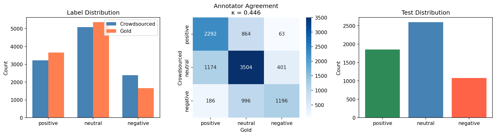
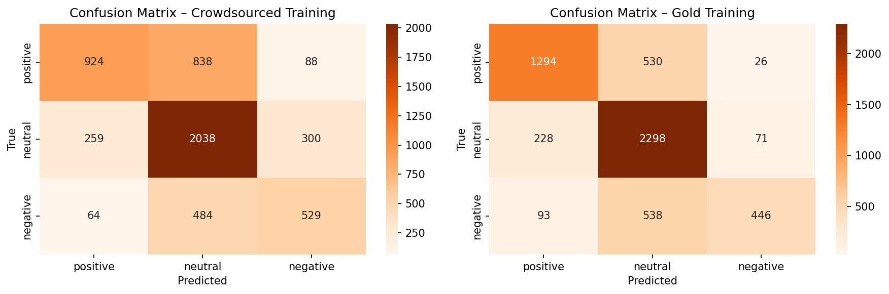
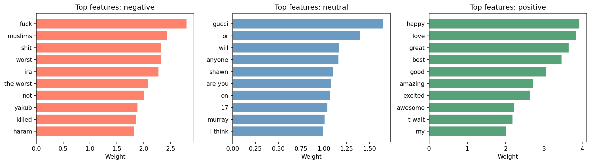

# Sentiment Classification of Tweets: Crowdsourced vs. Gold Annotations
A three-class (positive / neutral / negative) tweet sentiment classifier built with TF-IDF features and logistic regression. The project compares a model trained on **crowdsourced labels** against one trained on **expert labels** to measure how annotation quality affects performance.

Full write-up: [`Report`](./Report.pdf)

## Overview
**Text representation:** TF-IDF (unigrams + bigrams, sublinear TF scaling, `min_df=2`, 50,000-feature vocabulary)
**Classifier:** Multinomial logistic regression 
**Baseline:** Majority-class (always predicts "neutral"): 47.0% test accuracy
**Best model:** Trained on gold labels: **73.1% test accuracy**

| Model | 5-fold CV Acc | Test Accuracy |
|---|---|---|
| Baseline | — | 0.4701 |
| Logistic Regression (Crowdsourced) | 0.5768 ± 0.0093 | 0.6320 |
| Logistic Regression (Gold) | 0.6393 ± 0.0063 | 0.7310 |

Inter-annotator agreement between the crowdsourced and gold labels was moderate (Cohen's κ = 0.446, raw agreement 65.5%), and this label noise is the main driver of the ~10-point accuracy gap between the two models.

## Repository Contents
```
.
├── sentiment_classifier.py        # Full training/evaluation pipeline
├── Report.pdf                     # Written report with full analysis
├── data/
│   ├── crowdsourced_train.csv     # 10,676 tweets, crowdsourced labels
│   ├── gold_train.csv             # Same 10,676 tweets but with expert labels
│   └── test.csv                   # 5,524 held-out tweets, gold labels
└── images/
    ├── data_exploration.png
    ├── confusion_matrices.png
    └── top_features.png
```


## Pipeline
1. **Load data**: read the three tab-separated CSVs.
2. **Clean crowdsourced labels**: lowercase, strip whitespace, and map 37 label variants (typos like `postive`, `nuetral`, `negayive`) to the three canonical classes.
3. **Inter-annotator agreement**: compare crowdsourced vs. gold labels on the same tweets using raw agreement and Cohen's kappa.
4. **Visualize**: label distributions, agreement heatmap, and test set distribution.
5. **Train models**: one pipeline trained on crowdsourced labels, one on gold labels, each evaluated with 5-fold CV and on the held-out test set.
6. **Confusion matrices**: for both models on the test set.
7. **Feature analysis**:  top 10 TF-IDF-weighted terms per class.
8. **Summary**
   
## Results

### Data Exploration 
Label distributions across the crowdsourced, gold, and test sets, plus the crowdsourced-vs-gold agreement matrix (κ = 0.446).



### Confusion Matrices
Test-set confusion matrices for the crowdsourced-trained (left) and gold-trained (right) classifiers. The gold model shows notably better recall on the negative class.



### Top Features per Class
Top 10 TF-IDF-weighted terms per class from the gold-trained model.



## Usage
```bash
pip install pandas numpy matplotlib seaborn scikit-learn
python sentiment_classifier.py
```

Expects `crowdsourced_train.csv`, `gold_train.csv`, and `test.csv` in an `data/` subdirectory (tab-separated, UTF-8). Outputs three PNG figures and a `results.pkl` file.

